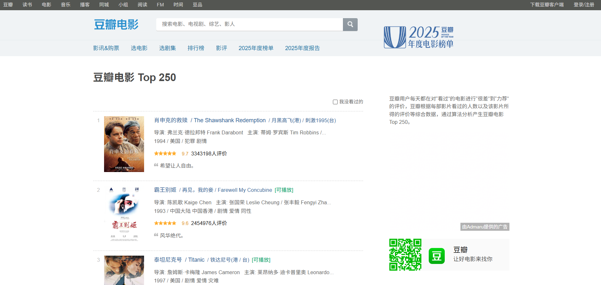
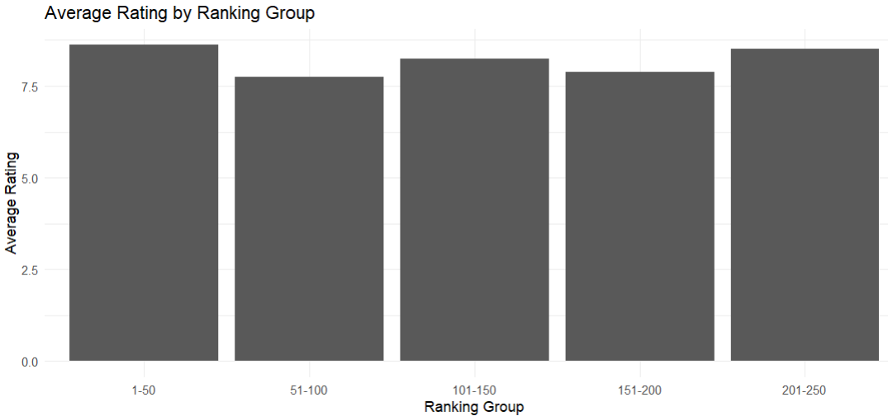
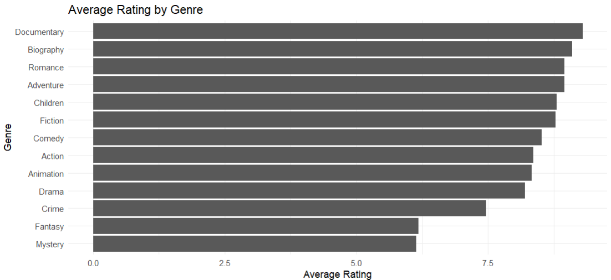
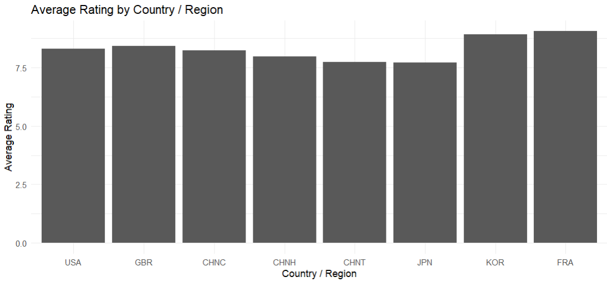
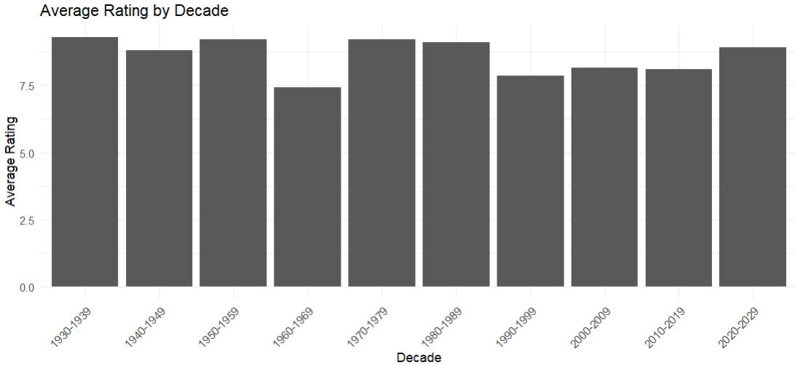

## Introduction

Douban, a popular film and book review website from China, has a good reputation and a huge amount of audience who carefully rate and comment on films and books from different countries and times. It is particularly known for its top 250 film list, which is ranked among all the films in the world. The list is considered a useful tool for those who want to watch a film with good reputations. As a film fan, I have frequently referred to this list, along with specific comments and ratings, when selecting classic films to watch.

The ranking of the list is carefully calculated through algorithms, according to the weighted sum of effective ratings from reliable reviewers. This is realized through the analysis of the overall behavior of each reviewer, which the platform could monitor. This brings a high reliability for the list, while the specific calculation remain different. Plus, the audience would not blindly follow the list when selecting films, as they have specific tastes for different types of films. Thus, they would still check the basic info of a film like I do, while the list offers a general spectrum.

The most direct way to refer to a film’s quality is the average rating for each film, which is visible to the audience. However, as this is already a list of top films, the ratings as references could imposes questions: are they still valuable when the fluctuation is highly restricted for the top list? Particularly, as commenters may be more careful and picky when giving high rates, could there be any bias for the Chinese view films of different types?

## Data Analysis

In this blog, we employ RVEST using R to scrape data on the top 250 film list from the Douban website, attempting to answer these questions through some simple data analysis. We collect data on the ranking, country, year, and genre of each film within the Top 250 list, and again, employ R to conduct analysis and visualization.We group films respectively according to the ranking (50 films a group), production year (a decade for each group),the genre, and the country (we only analyze the major countries here). We then calculate and plot the average rating for each group.

We first discover that the average rating does not necessarily correlate with the ranking of a film. Indeed, we do not observe a downward trend of average ratings along with rankings (the invisible effective ratings follow this rule, as they are exactly the reference of the ranking!). Therefore, we may tell that the visible average ratings plays an insignificant part within this top list, as the effective rating is hardly correlated with the visible rating.

We then check if different categories of films would exhibit different ratings. Different categories are not supposed to be assigned with different art values, therefore this might indicate some preferences of Chinese audience.

Regarding genre, we find that fantasy and mystery films receive particularly low scores, and crime films receive lower scores to some degree as well. It could be speculated that these are relatively niche genres, which possess relatively fewer audiences with strong preferences. Other genres generally receive high scores, with documentaries receiving the highest rating.

Moving to the category of country, because countries of production are relatively centralized for top films, we select some major countries for comparison, including China Hongkong, China Macao, China Taiwan, France, Britain, the U.S., Japan and South Korea. We find that Chinese audience seems to be critical on home country films compared with western major countries. A special finding is that Japan receives particularly low ratings, while South Korean films are highly recognized. This may also be explained by subjective tastes.

Another attempt we made is to group years of production and see if there are any regularities. We find steady fluctuations by decades, without a strong direction of trend.

## Conclusion

In general, through the data we scraped from Douban’s top film list, we managed to conduct a series of statistical analysis. We find that the visible ratings among the top-listed films are of insignificant reference value, as they remain stable across rankings of the list. We also find that the Chinese audience might has preferences over documentaries and South Korean films, while domestic films, Japanese films, and films under the genre of mystery or fantasy receive generally less preferences.

The findings help us rationally and carefully treat the ratings on major review platforms. Our findings imply that visible ratings from the well-known Douban platform might lose effectiveness within the top 250 list, and ratings on films of certain types (Fantasy, Japanese, domestic, etc.) could be biased when cross-compared with other categories. It is possible that similar patterns exist among other similar rating platforms, which might be a path for future investigations.