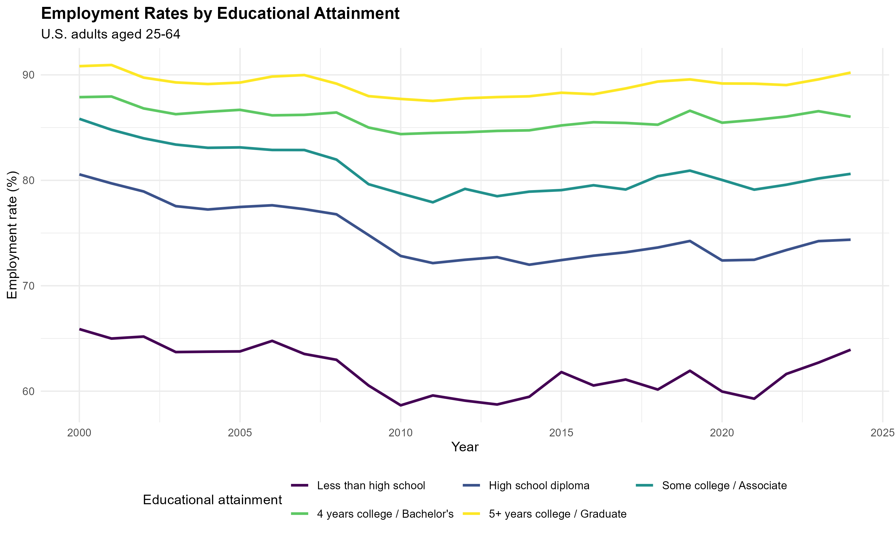
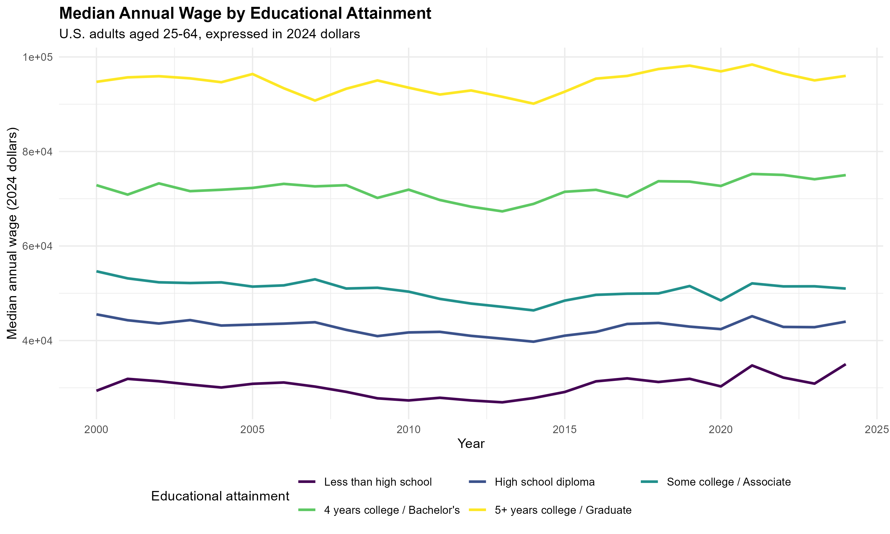
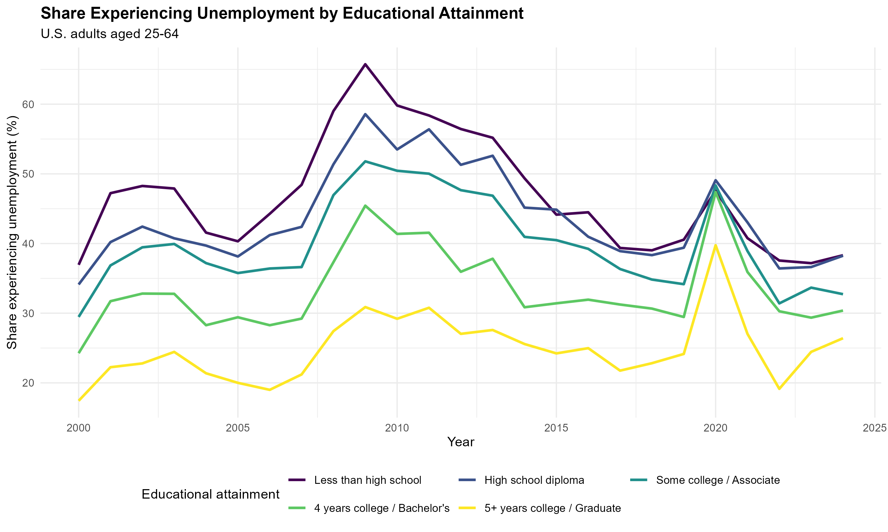

## Research Question

Educational background of labor is an important determinant of labor market outcomes. People with higher levels of education could enjoy better employment opportunities and higher salaries, while they may also experience less unemployment. Meanwhile, the relationship between education and the labor market varies across time, as different macroeconomic backgrounds, market structure, and other external factors could all help shape this relationship.

This blog post explores the following question: how are education attainment and labor market outcomes related in the United States, and how does this relationship change over time?

This analysis targets adults in the U.S., aged 25-64, and the observation covers the period of 2000-2024. Individuals are divided into five groups according to educational attainment: less than high school, high school diploma, some college or an associate degree, four years of college or a bachelor's degree, and five or more years of college or a graduate degree.

## Data and Mechanism

I employ the following three dimensions to evaluate labor market outcomes: whether individuals worked during the year, how much their income was (if they worked), and whether they experienced unemployment during the year. These dimensions respectively evaluate access, return, and risk regarding employment.

The data source is the Annual Social and Economic Supplement (ASEC) of the Current Population Survey (CPS). The CPS is a nationally representative survey conducted by the U.S. Census Bureau and the Bureau of Labor Statistics, and the ASEC covers information on work, income, and other socioeconomic elements.

I use individual samples during the period 2001-2025 because surveys collected information from the previous year instead of the current year. Therefore, the observation window corresponds to 2000-2024 as expected.

The main explanatory variable, educational attainment, is measured using the EDUC variable. EDUC records the highest level of schooling or degree completed, therefore covering many grades and degrees. They are categorized into five groups: less than high school, high school diploma, some college or associate degree, four years of college or bachelor's degree, and five or more years of college or a graduate degree. This is the reference group for surveyed individuals in the analysis.

For the first dimension, we calculate the share of people who worked during the year among the sum for each group. This comes from the variable WORKLY from the CPS dataset. The same is conducted for the third dimension, where we calculate the share of individuals who experienced unemployment during the year. This comes from the variable WKSUNEM1. For convenience, we will refer to these two dimensions as employment rate and unemployment in the analysis of the results, while one should not that our calculation may differ from the usual approaches in defining employment and unemployment rates.

For the second dimension, we use the variable INCWAGE as the original data source, which reports income in nominal U.S. dollars. We first transfer the income to real terms using the 2024 CPI as the basis (The CPI data comes from the Federal Reserve Bank of St. Louis FRED), then calculate the median for each group. We select the median instead of the mean value due to the highly skewed distribution of data.

All the shares and descriptive values above are calculated in the weighted form according to the person-level sampling weight from the dataset. This enables our findings to depict the whole U.S. labor market.

This produces three consistent time-series visualizations that can be compared directly across education groups.

## Findings

For the first dimension on the relation between education attainment and employment rate, we can tell from the figure that the higher the education level is, the higher the employment rate will be. This pattern is consistent over time, with individuals with 5+ years of college having an employment rate of around 90%, and individuals with less-than-high-school education having an employment rate fluctuating between 60% and 65%. From the time series visualization, we can also observe that the magnitude of fluctuation is negatively correlated with education level. Groups with higher education levels experience slight fluctuations in the employment rate over time. For instance, the downward slope of the employment rate is the steepest for the group with less-than-high-school education during the 2008 financial crisis.

For the dimension of income level, we also observe a consistent pattern that individuals with higher education levels would receive higher income. The group with the highest education level has a median income that is around 300% of the income level of the group with the lowest education level.

For the dimension of unemployment existence, we also observe that individuals with better education are less likely to become unemployed. This time-consistent regularity complements the first dimension of our evaluation, implying lower risks of unemployment. The difference in fluctuation magnitude is not observed across different groups of individuals.

## Conclusion

In general, our three sets of visual analyses reveal a consistent relationship between educational attainment and labor market outcomes in the United States from 2000 to 2024. Individuals with higher levels of education have a higher chance of working during the year, receive higher median wages, and are less likely to experience unemployment. These general trends persist over the observation window, and less-educated groups tend to experience larger fluctuations in employment. One should note that these findings are descriptive rather than causal, as other elements, such as work experience, occupation, and industry, may also contribute to the observed differences.
