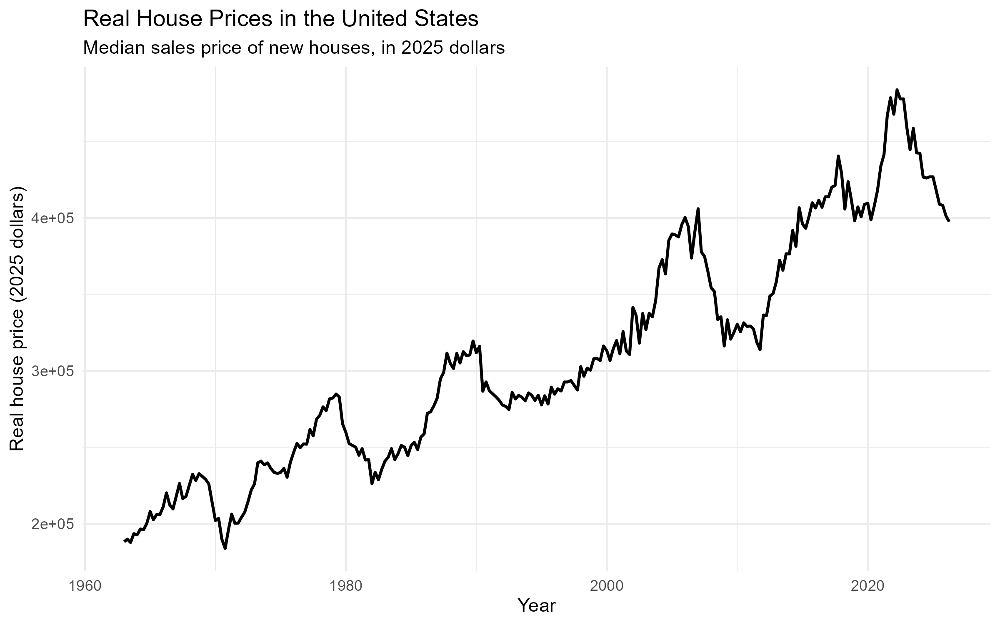
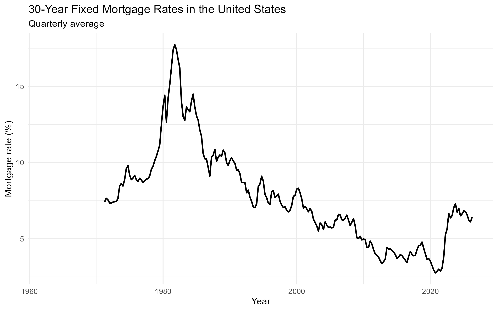
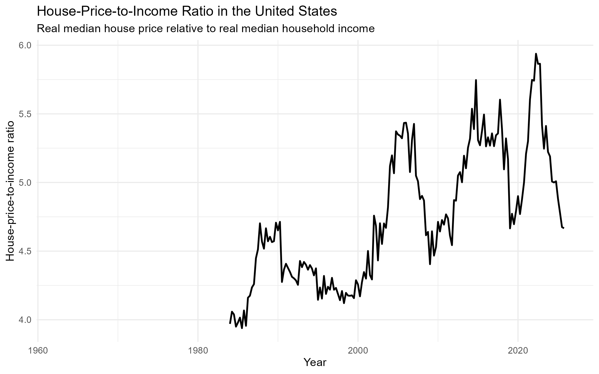

## Research Question

The purchase of a house involves the consideration of the price of housing as well as the individual’s income and cost of borrowing. A rise in house prices wouldn’t necessarily result in a proportional decline in affordability if household income rises. Similarly, lower mortgage rates may reduce the cost even when house prices are at a relatively high level.

This blog attempts to answer the following question:
**How has housing affordability in the United States changed over time, and what roles have house prices, mortgage rates, and household income played in this change?**

In particular, I examine three dimensions of the housing market: the real price of new houses, the 30-year fixed mortgage rate, and the ratio of real house prices to real median household income.

## Data

The data source for this blog is the Federal Reserve Bank of St. Louis FRED database. We use its API to scrape data from the website.

Four FRED series are used:

| Variable | FRED Series | Original Frequency | Role |
|---|---|---|---|
| Median sales price of new houses | `MSPUS` | Quarterly | Housing price |
| 30-year fixed mortgage rate | `MORTGAGE30US` | Weekly | Borrowing cost |
| Real median household income | `MEHOINUSA672N` | Annual | Household purchasing power |
| Consumer Price Index | `CPIAUCSL` | Monthly | Inflation adjustment |

The original data of different variables involve different frequencies, thus for the consistency within our analysis, the weekly mortgage rate and monthly CPI are transformed into quarterly averages. The quarterly median house price is kept at its original frequency. Annual median household income is matched to each quarter within the corresponding year.

For monetary values, the nominal median house price is converted into the real value to 2025 dollars using the CPI:

$$
RealHousePrice_t =
NominalHousePrice_t
\times
\frac{CPI_{2025}}{CPI_t}
$$

This adjustment allows house prices from different periods to be compared according to the same purchasing power.

Finally, I construct the house-price-to-income ratio:

$$
PriceIncomeRatio_t =
\frac{RealHousePrice_t}
{RealMedianHouseholdIncome_t}
$$

A higher value indicates that the price of ordinary houses is high relative to household's average income, implying the average level of housing affordability.

## Visualization Strategy

I use three time-series visualizations to analyze the trend on housing affordability. Each visualization focuses on a different component of housing affordability, and together they provide a broader picture of how the housing market has changed.

The first visualization plots the median sales price of new houses in constant 2025 U.S. dollars.

The figure shows a clear long-run increase in real house prices. Although the curve exhibits a few substantial downturns, the general level of real house prices is considerably higher in the 2020s than it was during the 1960s. The price doubled over the past 60 years.

Real house prices rose substantially during the late 1990s and early 2000s, reaching a peak around the housing boom before the financial crisis. Prices then declined sharply during the 2007–2009 housing market downturn.

After the financial crisis, housing prices recovered rapidly. The increase was especially sharp during the late 2010s and early 2020s. Real housing prices reached their highest level in the sample around 2022–2023 before declining afterward.

Therefore, the long-run increase in house prices holds after controlling for inflation, while there are a few fluctuations within the general trend.

The second visualization plots the quarterly average 30-year fixed mortgage rate.

Mortgage rates represent the cost of financing a home purchase. This variable complements the housing price index, as the two periods with similar house prices may have different affordability conditions if mortgage rates differ substantially.

The figure shows that mortgage rates, after a sharp rise in the late 1970s, followed a generally declining trend since the early 1980s, although with relatively small fluctuations.

The 30-year mortgage rate reached approximately 18% in the early 1980s, making home financing substantially more expensive than in later decades.

Mortgage rates then gradually declined over the following decades. By the 2010s, rates were generally much lower than their historical levels. The decline became particularly pronounced during the COVID-19 period, when mortgage rates reached a low level of around 3%.

After 2021, mortgage rates recovered significantly relative to the bottom level. By 2023, the 30-year mortgage rate returned to around 7%, substantially increasing the financing cost faced by new home buyers.

This pattern implies that housing price alone might not fully describe housing affordability during some period of times. The housing market in the early 2020s combined high housing price with an increase in mortgage rate, creating a different affordability environment from the low-rate period before.

The third visualization plots the ratio of real median house prices to real median household income.

This is the major affordability measure in the analysis, as the first two figures describe individual components of the housing market, the price-to-income ratio directly compares the cost of housing with household income.

The ratio was relatively stable around 4 in the mid-1980s and early 1990s. It then increased during the late 1990s and early 2000s, reaching 5 before the housing market crisis.

The ratio declined significantly when the financial crisis came in the late 2000s, which is consistent with the sharp decline in house prices shown in Figure 1.

After the financial crisis, the ratio recovered back. During the 2010s, housing prices grew faster than household income, pushing the ratio upward, and then a setback came again in the late 2010s. The increase went sharp during 2020–2023, when the ratio approached 6 in the sample.

The post-pandemic decline after 2022 is also clearly illustrated from the graph. The ratio falls substantially from its peak as real house prices declined. However, our graph 2 complements theexplanation of regularity here, as mortgage rates increased substantially during the same period, which means that the cost of financing a home became considerably higher even though the price-to-income ratio declined. This comparison between Figures 2 and 3 indicates that the price-to-income ratio and mortgage rates capture different dimensions of affordability, which are both significant.

## Conclusion

This project analyzes how housing affordability in the United States has changed over time by combining three dimensions of the housing market: real house prices, mortgage rates, and the house-price-to-income ratio.

The analysis shows that real house prices have increased significantly in the long run, despite several major downturns. At the same time, mortgage rates have experienced a long-term decline from the exceptionally high levels of the early 1980s, followed by a sharp increase after 2021.

The house-price-to-income ratio offers a trend of the relationship between housing costs and household resources. Its increase during the 2000s and especially the early 2020s suggests that housing became increasingly expensive relative to household income. The previous analysis on mortgage rate could help with the explanation to this trend.

The general takeaway of this study is that housing affordability relies on the interaction between housing price, household income, and borrowing cost. Taking early 2020s as an instance, the rapid house-price growth increased the price of housing relative to household income, while historically low mortgage rates temporarily reduced financing costs. After 2021, however, rising mortgage rates added another source of financial pressure for potential home buyers.

The visualization suggests that the economic burden of purchasing a house has increased over the long run, while this burden may have changed through different channels. Looking at house prices, income, and mortgage rates together offers a more informative picture of housing affordability than focusing on any single indicator.